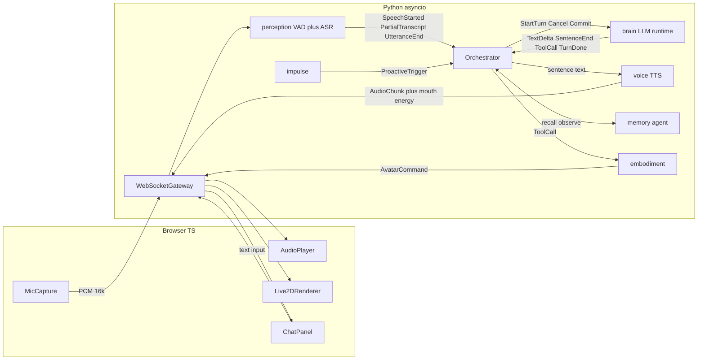
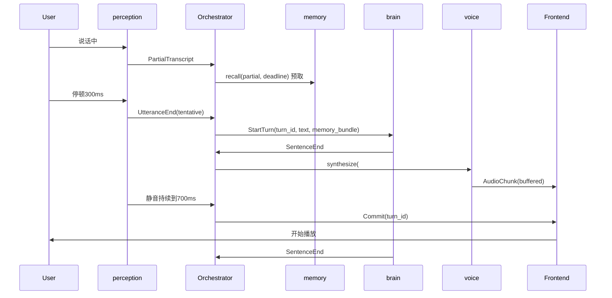

# ASM：基于 LLM 的长期 1 对 1 虚拟陪伴 —— 总体架构设计

日期：2026-09-14
状态：已与用户逐段确认。实现计划见 [2026-09-14-asm-implementation.md](2026-09-14-asm-implementation.md)

## 1. 目标与约束

**目标**：一个跑在用户本机、单用户、长期使用的虚拟陪伴。语音/文字双向交互，全双工（随时打断、不抢话、反应快、被打断后能接上），有 Live2D 形象随情绪做表情动作，有跨会话的长期记忆与人格一致性，能主动开口。

**已敲定的约束**

- 运行形态：本地 harness + 云端 API。不部署大模型；VAD 和流式 ASR 这类小模型可本地跑。
- 语言栈：Python asyncio 后端 + TypeScript 浏览器前端。不引入第三种语言。
- 对话模型：DeepSeek `deepseek-flash`（V4.1 Flash）。1M 上下文，支持流式、tool calls、JSON output、前缀缓存。实时对话关闭 thinking 模式。
- TTS：云端，中文优先，便宜。首选火山引擎豆包 TTS 双向流式 WebSocket；备选阿里 CosyVoice v3.5-flash。
- ASR/VAD：本地 sherpa-onnx（Silero VAD + 流式 Zipformer 中英双语）。
- Live2D：复用渲染库 `untitled-pixi-live2d-engine`（PixiJS v8，Cubism 2–5）+ Cubism 官方免费样例模型；harness 自己写，借鉴 Open-LLM-VTuber 的句级切分、能量数组口型、顺序队列做法。
- 主语言：中文为主，偶夹英文。

**工程原则**：第一性原理；如无必要勿增实体，但产品效果优先于极简；模块间只通过事件与接口通信，新功能以"挂新模块"方式叠加，不改旧模块；能并行的不串行。

## 2. 总体架构



### 2.1 分层原则

- **浏览器是哑终端**：采麦克风、播音频、渲染 Live2D、显示文字。不含对话逻辑、LLM、记忆、表情决策。将来换 Electron 桌宠等外壳，后端不动。
- **后端模块通过进程内异步事件总线通信**（`asyncio.Queue` + 类型化事件 dataclass）。模块不 import 彼此，只 import `core/events.py` 与 `core/interfaces.py`。
- **Orchestrator 是唯一知道对话状态的地方**。状态：`IDLE / LISTENING / SPECULATING / THINKING / SPEAKING`，加 `turn_id`。它只做状态迁移与派工，不含 prompt、TTS、记忆策略；目标体量一两百行。
- **每个模块 = 一个 Protocol 接口 + 若干实现**，切换靠配置。

### 2.2 统一取消机制

每轮对话有 `turn_id`。Orchestrator 广播 `Cancel(turn_id)`；所有模块检查手头任务的 `turn_id`，匹配即停（关 HTTP 流、关 TTS session、清队列）；前端收到 `Cancel` 清空播放缓冲与待执行表情队列。带旧 `turn_id` 的迟到数据一律丢弃。这一条规则解决所有打断后的竞态。

### 2.3 全双工机制

1. **麦克风常开**：`perception` 在 `SPEAKING` 状态也持续工作。浏览器 `getUserMedia` 开 `echoCancellation / noiseSuppression`。
2. **两级打断**：`SPEAKING` 时收到 `SpeechStarted` → 第一级（0ms）前端 duck 音量；第二级（约 300ms 内）若 ASR 半句 ≥2 个实义字或持续说话超阈值 → `Cancel`；否则 unduck 继续说。应和声（"嗯""对"）与咳嗽不会误打断。
3. **投机生成 + 语义收尾**：用户停顿约 300ms → `UtteranceEnd(tentative)` → 进入 `SPECULATING`，brain 开始请求、voice 开始合成首句，音频在前端缓冲**不播**。若用户又开口 → `Cancel` 投机轮，拼接新半句，等下一次停顿。若静音持续到约 600–800ms → `Commit(turn_id)`，前端立即放出缓冲音频。用户感知延迟 ≈ max(静音阈值, 首句 + TTS 首包)。
4. **被打断后知道说到哪**：前端播放进度按 `sentence_idx` 回报 `SpokenProgress(turn_id, idx)`。`Cancel` 时对话历史写入**实际说出口的部分** + `[被打断]` 标记，而非 LLM 全文。

**边界**：级联架构做不到人类式重叠对话（两人同时说且互相理解），端到端语音模型才有。以上四条覆盖日常"全双工感"。

### 2.4 目录结构

```
asm/
  backend/
    asm/
      core/         events.py, bus.py, orchestrator.py, interfaces.py, config.py
      perception/   vad_silero.py, asr_sherpa.py
      brain/        runtime.py, prompt.py, deepseek_client.py, tool_parser.py
      voice/        volcengine_tts.py, cosyvoice_tts.py, mouth_energy.py
      memory/       agent.py, tools.py, prompts/, eval/replay.py
      embodiment/   vocab.py, rules.py, mapper.py, state_pose.py
      impulse/      scheduler.py, triggers.py
      gateway/      ws_server.py (FastAPI)
    tests/
  frontend/         Vite + TS：Live2D 画布 + 聊天面板 + 麦克风控制
    src/            mic_capture.ts, audio_player.ts, live2d_renderer.ts, ws_client.ts, chat_panel.ts
    public/models/  Live2D 模型 + avatar_map.json
  data/             persona/, memory/, logs/（可读文件，git 忽略）
  docs/
```

`perception` 放后端而非浏览器：sherpa-onnx 在 Python 最成熟；浏览器只推 PCM（localhost，毫秒级）。浏览器端唯一延迟敏感的工作是播放时的口型，用后端算好的能量数组本地驱动。

## 3. brain：对话 runtime

**职责**：输入 `TurnRequest`，流式输出 `TextDelta / SentenceEnd / ToolCall / TurnDone / TurnAborted`，随时可 `Cancel`。不知道语音、Live2D、记忆内部。

### 3.1 Prompt 结构（稳定前缀在前，为前缀缓存设计）

```
[1] 系统规则        固定：口语、1–3 句、不用 markdown/列表/括号动作描写、
                   数字与缩写写成可读形式、工具用法、输出格式
[2] persona.md      她是谁。很少变
[3] 长期记忆常驻    MEMORY.md 索引 + relationship.md + self_state.md（memory agent 维护，有长度上限）
[4] 会话摘要        当前 session 早期对话的压缩（超预算后由 memory 生成）
[5] 情境块          日期/星期/时间、距上次聊天时长、本轮 MemoryBundle.snippets
[6] 最近对话原文    最近 N 轮（含 [被打断] 标记、工具调用记录）
[7] 用户本轮输入   （主动轮为 "[系统：你想主动说点什么，原因：…]"）
```

[1]+[2]（+[3] 大部分）命中缓存，价格为未命中的 1/50。说话风格约束放在 [1]，是"像人"的第一杠杆。

### 3.2 流式与句切分

- `deepseek_client.py`：OpenAI 兼容 SDK，`model="deepseek-flash"`，`stream=True`，关闭 thinking。
- `runtime.py`：累积 delta，遇 `。！？；…` 或换行且当前句 ≥ 最小字数时发 `SentenceEnd(turn_id, idx, text)`。首句阈值更低（≥4 字）以加速首音，后续放宽。

### 3.3 工具调用

- brain 不硬编码任何工具。启动时收集所有 `ToolProvider.tools()` 注册 schema（embodiment 注册 `set_emotion`；未来 memory/其他模块各自注册）。
- brain 把 `ToolCall` 作为流式事件原样发出，不执行；谁订阅谁执行。
- `ToolCallParser` 接口，两个实现：原生 tool call 解析；内联轻量标记解析（fallback）。第一周实测 DeepSeek 流式下文本与 tool call 的交错行为后选定。

### 3.4 上下文预算

brain 维护 `ContextBudget`（如最近对话原文 ≤ 12k tokens）。超出时发 `CompressionNeeded(messages)`，memory 负责摘要并回填 [4]。brain 管预算，memory 管内容。

### 3.5 一轮的关键路径



## 4. 语音链路

### 4.1 perception（本地 VAD + 流式 ASR）

- 输入：浏览器 `AudioWorklet` 采集并重采样为 16kHz 单声道 PCM16，20ms/帧，经 WebSocket binary 推送。
- VAD：Silero VAD（sherpa-onnx 内置），产出 `SpeechStarted / SpeechEnded(silence_ms)`。是打断与端点判定的唯一信号源。
- ASR：sherpa-onnx 流式 Zipformer 中英双语（首选），流式 Paraformer 备选。每 100ms 解码，文本变化即发 `PartialTranscript`；端点判定时发 `UtteranceEnd(final_text)`。
- 热词：persona 与 user profile 中的人名、地名、常用专名注入 hotwords 提升识别率。
- 接口：`SpeechPerceiver.feed(pcm: bytes)` + 事件输出。切云端 ASR = 新实现 + 配置。

### 4.2 voice（云端双向流式 TTS）

- 接口：`TTSEngine.synthesize(turn_id, sentence_idx, text) -> AsyncIterator[AudioChunk]`；`cancel(turn_id)`。
- 首选火山豆包 TTS 双向流式 WebSocket：长连接常驻，每轮一个 session，逐句推入，音频分片流出（首包 <300ms）。备选 CosyVoice v3.5-flash。音色选择放实验期。
- 输出：`AudioChunk(turn_id, sentence_idx, seq, pcm16, mouth_energy[])`。`mouth_energy` 为每 20ms 归一化 RMS，后端计算。
- 传输：localhost，PCM16 二进制帧直传，不编解码。
- 顺序：voice 内部按 `(turn_id, sentence_idx, seq)` 排序后发送；前端只追加。

### 4.3 前端 AudioPlayer

`enqueue(chunk)` / `commit(turn_id)` / `cancel(turn_id)`（清队列 + 50ms 淡出）/ `duck()` / `unduck()`；按 `sentence_idx` 回报播放进度；播放时按时间轴读 `mouth_energy` 驱动口型。

### 4.4 延迟预算（目标）

- 投机触发 300ms，提交 600–800ms（可调）
- 本地 ASR 收尾 <100ms
- DeepSeek 首句（非 thinking，4–10 字）400–800ms
- TTS 首包 <300ms
- 前端缓冲 + 启动 <50ms
- 用户感知 ≈ 0.8–1.2s，目标 1s 上下

### 4.5 错误处理

- TTS 断连 → `VoiceError(turn_id)`，本轮降级为纯文字，自动重连。
- ASR 模型加载失败 → 启动报错退出（硬依赖）。
- DeepSeek 5s 无首 token → 取消重试一次，再失败播预置兜底语。

## 5. memory：管文件的 memory agent

### 5.1 定位

一个独立于对话模型的 LLM agent（`deepseek-flash`，反思/dream 时开 thinking），只拥有 `ls / read / grep / write_section / append` 五个工具，作用域锁定 `data/memory/`。职责：让 memdir 始终是关于"你、她、你们"的一份干净、无矛盾、可快速定向的档案。brain 从不直接读写文件，只消费 `MemoryBundle`。

不使用 BM25/FTS/向量检索。检索质量来自档案整理得好，`grep` 就是检索。将来若需要，向量检索可作为 agent 的第六个工具叠加。

### 5.2 接口（Orchestrator 只认这四个）

```python
class MemoryStrategy(Protocol):
    async def recall(ctx: RecallContext, deadline_ms: int) -> MemoryBundle
    async def observe(turn: TurnRecord) -> None
    async def compress(messages: list[Message]) -> str
    async def on_session_start() -> None
    async def on_session_end() -> None
```

- `RecallContext`：当前半句/整句 + 最近几轮 + 时间。
- `MemoryBundle`：`{常驻块(索引/关系/自我状态), snippets[], open_threads[]}`。
- `deadline_ms`：超时返回上一轮缓存 bundle，本轮先用旧的。保证后台模型不拖实时路径。

### 5.3 memdir 布局

```
data/memory/
  persona.md          她是谁。只有用户能改，agent 只读。一致性的锚。
  MEMORY.md           索引：每条一行 `- [标题](file.md) — 一句话钩子`，≤200 行，不放正文
  user/*.md           关于用户：按主题分文件（工作、家人、健康、偏好…）
  relationship.md     关系状态、约定、梗、承诺、未聊完的话题
  self_state.md       她的情绪、心事、近期看法（可写、有上限）
  logs/YYYY-MM-DD.md  每日流水，append-only
  transcripts/*.jsonl 原始逐轮记录，agent 只 grep 不通读
  .changelog.jsonl    每次写入的 diff，可审计可回滚
  .dream-lock         dream 并发锁（mtime = 上次 dream 时间）
```

常驻文件（`MEMORY.md / relationship.md / self_state.md`）有硬性长度上限。

### 5.4 五个运行时机

1. **注入（每轮，零延迟）**：常驻块进 prompt [3]。
2. **侧查询选择（每轮，有 deadline）**：收到 `PartialTranscript` 即启动短工具循环（≤2–3 步：读索引 → grep/read 1–2 个主题文件），产出 `snippets`。
3. **轮末抽取（每轮，异步）**：`observe` 后判断是否值得记（事实/偏好/关系/承诺四类），值得则 `append` 到 `logs/今天.md`。只追加，不改主题文件。
4. **会话压缩（触发式）**：响应 `CompressionNeeded`，摘要回填 prompt [4]，同时落到 `logs/`。
5. **Dream（后台巩固，门控）**：距上次 ≥N 小时 且 累积 ≥M 会话 且 无锁 → thinking 模式长任务：读索引 → 读近期 logs → 对疑点 grep transcripts → 合并进主题文件（去重、相对日期转绝对、删被推翻的旧事实、超长合并压缩）→ 审视 `self_state.md` 是否与 persona 冲突 → 重写 `MEMORY.md`。失败回滚锁。

### 5.5 写入规则

记稳定事实、偏好、重要事件、承诺与伏笔、情绪重要时刻；不记闲聊原文与一次性琐事；矛盾时新覆盖旧并留 changelog；文件超上限必须合并压缩而非追加。

### 5.6 实验框架

`memory/eval/replay.py`：重放 `transcripts/`，在不同 agent 提示词/工具步数/门控参数下运行，输出每轮 bundle 内容、注入 token、耗时；LLM 判官打"召回是否有用"分。迭代对象是 agent 的提示词与参数。

## 6. embodiment：Live2D 控制

### 6.1 LLM 侧：一个工具

```json
set_emotion(emotion: "neutral|happy|shy|sad|surprised|angry|thinking|playful|agree|disagree", intensity?: 0-1)
```

模型只表达情绪/态度，不选动作、不碰参数。词汇表在 `embodiment/vocab.py`，与任何 Live2D 模型无关，prompt 因此稳定。

### 6.2 两层确定性映射

- **规则表 `rules.py`**（情绪 → 表情 + 动作候选 + 强度缩放），纯函数，可单测：

```python
RULES = {
  "happy":     Rule(expression="happy", motions=["laugh", "nod"], pick="random"),
  "shy":       Rule(expression="shy", motions=["look_away"]),
  "agree":     Rule(expression=None, motions=["nod"]),
  "thinking":  Rule(expression="thinking", motions=["tilt"]),
  "surprised": Rule(expression="surprised", motions=["lean_in"], intensity_scale=True),
}
```

- **模型映射表 `public/models/<name>/avatar_map.json`**（语义表情名/动作名 → 该模型的表情文件与动作组索引，含 `lipsync_param`、`fallback_expression`）。缺失项加载时 warn 并落到 fallback。

### 6.3 时序对齐

`AvatarCommand` 带 `(turn_id, sentence_idx)`，前端挂在对应句子开播时刻执行，避免"脸先笑嘴才说"。`Cancel(turn_id)` 连带清除。

### 6.4 前端 Live2DRenderer

- 库：`untitled-pixi-live2d-engine` + 官方 `live2dcubismcore.min.js`；模型先用 Cubism 官方免费样例。
- 接口：`setExpression(id)` / `playMotion(group, idx)` / `setMouthOpen(0–1)` / `lookAt(x, y)`。
- 口型：每帧按播放时间读 `mouth_energy` 并平滑。
- 空闲行为（眨眼、呼吸、视线游移、Idle 动作）前端自理，不经 LLM。
- 状态姿态：`LISTENING` 倾听姿态、`THINKING` 思考表情，由 Orchestrator 状态事件经 `state_pose.py` 表触发，不经 LLM。

### 6.5 不做

LLM 直控参数级（眉毛角度等）；基于音频韵律自动推情绪（将来可作为 embodiment 的另一个 `CommandSource` 叠加）。

## 7. impulse：主动性

独立调度器，发 `ProactiveTrigger(reason, hint)`。Orchestrator 将其作为无用户输入的普通轮处理；其余模块无感。第一版三种触发：

- **沉默陪伴**：`IDLE` 持续 N 分钟且麦克风在线 → 低概率触发，hint 取 `self_state.md` 心事或 `relationship.md` 未聊完话题。
- **伏笔回访**：会话开始扫 `relationship.md` 带日期条目，到期触发。
- **会话开场**：连接建立时触发一次，带"距上次聊天 X 小时"。

有冷却与每日上限。主动轮同样可被 `Cancel`。

## 8. 时间感

prompt 情境块永远携带日期/星期/时间与"上次聊天距今"。最便宜的"像人"手段。

## 9. Non-goals（第一版不做，接口预留）

- 视觉感知（摄像头/屏幕）：将来作为 `perception` 第二实现，发 `VisualObservation`。
- 端到端语音模型替代级联链路。
- 多角色、多用户、桌宠悬浮窗、移动端。
- 声音复刻：TTS 厂商功能，配置级。

## 10. 成本估算

按 `deepseek-flash` 非峰时、每天 1 小时 ≈ 60 轮含投机废弃：对话模型约 $0.03/天；memory agent 约 $0.02/天；TTS 每天约 1 万字，火山字数包约 ¥1–2/天。合计约 ¥50–80/月，TTS 为大头。

## 11. 测试策略

- 模块独立测试：perception 喂 wav 断言事件序列；brain 用 mock LLM 流断言句切分与 tool call 解析；voice 用 mock TTS 断言排序与能量数组；embodiment 纯函数表；memory 用回放脚本。
- Orchestrator 状态机：事件脚本 + fake clock 测时序用例（如 "SPEAKING 时 SpeechStarted → 300ms 内无实义 PartialTranscript → 恢复"）。
- 端到端冒烟：录好的 wav → 断言 1s 内前端收到首个 AudioChunk，作为延迟回归守门。
- 结构化日志：每轮记录 VAD 端点、首 token、首句切分、TTS 首包、前端首播时间戳。

## 12. 迭代路线（每步独立可用）

1. **骨架**：events/bus/orchestrator + 文字进文字出 + mock 模块；验证取消机制与状态机。
2. **能说**：deepseek-flash 流式 + 火山 TTS + 前端播放器；句级流水线；延迟日志。
3. **能听 + 打断**：sherpa-onnx VAD/ASR、投机生成、两级打断、被打断进度回写。
4. **有脸**：Live2D 渲染、口型、`set_emotion` 规则表、表情对齐句开播。
5. **有记忆**：memory agent 注入 + 侧查询 + 轮末抽取 + 压缩，最后 dream；回放评测脚本。
6. **会主动**：impulse 三种触发。

## 13. 第一周实验敲定的开放问题

- DeepSeek 流式下文本与 tool call 交错输出的实际行为 → 选定 `ToolCallParser` 实现。
- 本地 Zipformer 对用户日常用语的识别率 → 不够则切云端 ASR。
- 投机/提交静音阈值、打断第二级阈值的具体数值。
- 火山 vs CosyVoice 音色与首包实测。
