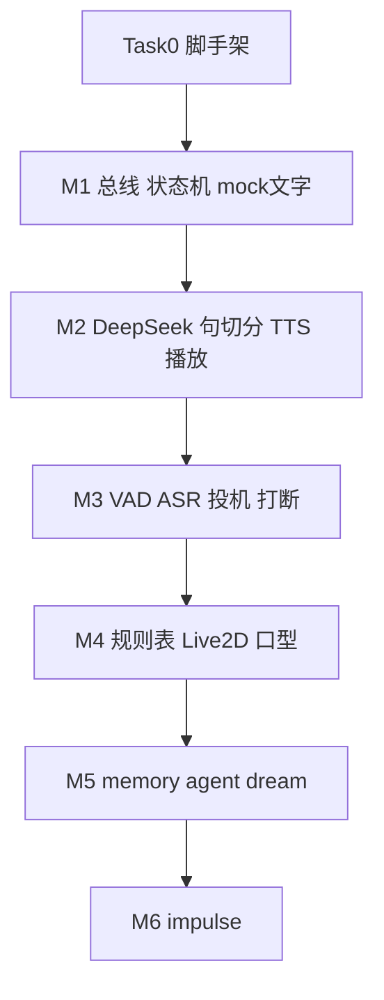

# ASM 实现计划

> 对应规格：[2026-09-14-asm-architecture-design.md](2026-09-14-asm-architecture-design.md)
>
> 日期：2026-09-14
>
> 用法：按任务顺序做。每个任务先写失败测试，再写刚好让测试通过的实现。做完一题再做下一题。不要跳过验收。

## 目标

在本机跑通一个可扩展的虚拟陪伴 harness：Python asyncio 后端 + TypeScript 浏览器前端。模块只通过事件/接口通信。第一版用户可感知的闭环是「文字进、语音出、可取消」；之后按里程碑叠加听、脸、记忆、主动开口。

## 范围

本计划覆盖规格第 12 节全部 6 个里程碑。M1–M2 是第一批必须做完才能演示的切片；M3–M6 任务已写清，但**不要在 M2 验收前开始**。

本计划不包含：视觉感知、端到端语音模型、多用户、桌宠壳、声音复刻、CosyVoice 第二实现（接口预留即可）。

## 技术栈（锁定）

| 层 | 选择 | 不选的理由 |
|---|---|---|
| 后端 | Python 3.12+、asyncio、FastAPI、uvicorn | 规格已定 |
| 包管理 | `pyproject.toml` + pip/uv，不用 Poetry | 少一个工具 |
| LLM | `openai` SDK，`base_url=https://api.deepseek.com`，`model=deepseek-flash`，`extra_body={"thinking": {"type": "disabled"}}` | 官方兼容层；默认 thinking 必须关 |
| TTS | 火山 V3 双向流式 `wss://openspeech.bytedance.com/api/v3/tts/bidirection`，请求 PCM 避免解码器 | 首包低、可逐句推入 |
| ASR/VAD（M3） | `sherpa-onnx` + Silero VAD + `sherpa-onnx-streaming-zipformer-bilingual-zh-en-2023-02-20` | 规格已定 |
| 前端 | Vite + 原生 TypeScript，不用 React | 一页，实体最少 |
| Live2D（M4） | `untitled-pixi-live2d-engine` + 用户自行放置的 `live2dcubismcore.min.js` | Cubism 核心有许可限制，不进仓库 |
| 测试 | pytest + pytest-asyncio + 注入 `Clock` | Orchestrator 时序必须可单测 |

## 仓库骨架（Task 0 一次建齐，之后任务往里填）

```
asm/
  pyproject.toml
  README.md
  .env.example
  .gitignore
  backend/
    asm/
      __init__.py
      app.py                 # 组合根：读配置、接线、启动
      core/
        events.py
        bus.py
        clock.py
        session.py
        orchestrator.py
        interfaces.py
        config.py
      perception/            # M3 填
      brain/                 # M2 填
      voice/                 # M2 填
      memory/                # M1 stub；M5 真实现
      embodiment/            # M1 stub；M4 真实现
      impulse/               # M6 填
      gateway/
        protocol.py
        ws_server.py
    tests/
      conftest.py
      core/
      brain/
      voice/
      perception/
      embodiment/
      memory/
      gateway/
  frontend/
    package.json
    vite.config.ts
    index.html
    src/
      main.ts
      ws_client.ts
      chat_panel.ts
      audio_player.ts        # M2
      mic_capture.ts         # M3
      live2d_renderer.ts     # M4
    public/
      pcm-worklet.js         # M3
      models/                # M4，git 忽略模型二进制
  data/
    memory/                  # persona.md 住在这里（agent 只读）；M5 起用其余文件
    models/                  # ASR/VAD，git 忽略
    logs/                    # 延迟日志等；日记在 data/memory/logs/
  scripts/
    download_asr_models.sh   # M3
  docs/
```

## 跨模块契约（先读再写代码）

### 事件

全部事件是 `frozen` dataclass，定义在 [`backend/asm/core/events.py`](../backend/asm/core/events.py)。模块只 import 这个文件和 `interfaces.py`。

M1 就要定义**全量**事件类型（含 M3–M6），避免后面改 import。未用事件先不发。

```
# 生命周期
Cancel(turn_id)
StartTurn(turn_id, text, speculative: bool, memory_bundle)
Commit(turn_id)
TurnDone(turn_id)
TurnAborted(turn_id, reason)

# perception → orch
SpeechStarted()
SpeechEnded()
PartialTranscript(text)
UtteranceEnd(text)            # ASR 在本段语音结束时的最终文本

# brain → orch
TextDelta(turn_id, text)
SentenceEnd(turn_id, sentence_idx, text)
ToolCall(turn_id, sentence_idx, name, arguments)
CompressionNeeded(messages)

# voice → orch / gateway
AudioChunk(turn_id, sentence_idx, seq, pcm16: bytes, sample_rate, mouth_energy: list[float])
VoiceError(turn_id, message)

# frontend → orch
TextInput(text)
SpokenProgress(turn_id, sentence_idx)
MicState(open: bool)

# orch → frontend
StateChanged(state)
Duck() / Unduck()

# impulse → orch
ProactiveTrigger(reason, hint)

# embodiment → frontend（经 gateway）
AvatarCommand(turn_id, sentence_idx, expression, motion)
```

`turn_id` 是 UUID4 字符串。迟到事件的 `turn_id` 不等于 `session.current_turn_id` 时，Orchestrator 和各模块一律丢弃。

### 总线

[`backend/asm/core/bus.py`](../backend/asm/core/bus.py)：按**事件类型**订阅，`async def publish(event)` 依次 `await` 该类型的 handler。单个 handler 抛错要 catch + log，不阻断其他 handler。

禁止用字符串 topic。禁止模块互相 import。

### 接口

[`backend/asm/core/interfaces.py`](../backend/asm/core/interfaces.py)：

```python
class Clock(Protocol):
    def now(self) -> float: ...
    async def sleep(self, seconds: float) -> None: ...
    def call_later(self, seconds: float, cb) -> TimerHandle: ...

class SpeechPerceiver(Protocol):
    async def feed(self, pcm16: bytes) -> None: ...
    async def close(self) -> None: ...

class Brain(Protocol):
    async def start_turn(self, req: TurnRequest) -> None: ...
    async def cancel(self, turn_id: str) -> None: ...

class TTSEngine(Protocol):
    async def synthesize(self, turn_id: str, sentence_idx: int, text: str) -> AsyncIterator[AudioChunk]: ...
    async def cancel(self, turn_id: str) -> None: ...

class MemoryStrategy(Protocol):
    async def recall(self, ctx: RecallContext, deadline_ms: int) -> MemoryBundle: ...
    async def observe(self, turn: TurnRecord) -> None: ...
    async def compress(self, messages: list[Message]) -> str: ...
    async def on_session_start(self) -> None: ...
    async def on_session_end(self) -> None: ...

class ToolProvider(Protocol):
    def tools(self) -> list[ToolSpec]: ...
    async def handle(self, call: ToolCall) -> None: ...  # embodiment 用；brain 不调用
```

### Orchestrator 状态

`IDLE | LISTENING | SPECULATING | THINKING | SPEAKING`

M1 只用 `IDLE / THINKING`（文字流式输出期间算 THINKING；没有语音就没有 SPEAKING）。M2 在首句音频入队且 `Commit` 后进入 `SPEAKING`；文字输入的轮次在 M2 直接 `Commit`（无投机）。M3 才启用 `LISTENING / SPECULATING` 与两级打断。

状态机从第一天就带齐五态枚举和 `Cancel(turn_id)` 广播。

### WebSocket 协议

控制面一律 JSON text frame，schema 在 [`backend/asm/gateway/protocol.py`](../backend/asm/gateway/protocol.py) 用 pydantic 校验。音频上行（M3）是 raw PCM16 little-endian 二进制 frame（16 kHz mono，每帧 20 ms = 640 bytes）。音频下行（M2）先走 JSON：

```json
{"type":"audio_chunk","turn_id":"...","sentence_idx":0,"seq":0,"sample_rate":24000,"mouth_energy":[0.1,0.4],"pcm_b64":"..."}
```

localhost 上 20 ms 一包的 base64 开销可忽略，调试比自定义二进制信封容易。若 M2 延迟日志显示序列化 >10 ms，再改二进制，不提前做。

客户端 → 服务端 JSON：

| type | 字段 | 起始里程碑 |
|---|---|---|
| `text_input` | `text` | M1 |
| `spoken_progress` | `turn_id`, `sentence_idx` | M2 |
| `mic_state` | `open` | M3 |

服务端 → 客户端 JSON：

| type | 字段 | 起始里程碑 |
|---|---|---|
| `state` | `state` | M1 |
| `text_delta` | `turn_id`, `text` | M1 |
| `sentence` | `turn_id`, `sentence_idx`, `text` | M2 |
| `audio_chunk` | 见上 | M2 |
| `commit` | `turn_id` | M2 |
| `cancel` | `turn_id` | M1 |
| `duck` / `unduck` | | M3 |
| `avatar_command` | `turn_id`, `sentence_idx`, `expression`, `motion` | M4 |
| `error` | `message` | M1 |
| `latency` | `turn_id`, `marks` | M2 |

### 配置

[`backend/asm/core/config.py`](../backend/asm/core/config.py) 从环境变量读，缺省值写死在 dataclass。`.env.example`：

```
DEEPSEEK_API_KEY=
VOLC_TTS_APP_KEY=
VOLC_TTS_ACCESS_KEY=
VOLC_TTS_RESOURCE_ID=seed-tts-2.0
VOLC_TTS_SPEAKER=
ASM_HOST=127.0.0.1
ASM_PORT=8765
```

密钥只进环境，不进仓库。

### 投机与打断的职责切分（M3 用，M1 先写进注释）

- perception **只**发 `SpeechStarted / SpeechEnded / PartialTranscript / UtteranceEnd`，不设 300/700 ms。
- Orchestrator 持有两个可配置阈值：`speculate_after_ms=300`、`commit_after_ms=700`、`barge_in_confirm_ms=300`、`barge_in_min_chars=2`。
- 这样调参只改 config，不改 ASR。

---

## Task 0 — 仓库与工程脚手架

**目标**：空目录变成可跑 `pytest` 和 `npm` 的仓库。

**文件**：`pyproject.toml`、`.gitignore`、`.env.example`、`README.md`、`backend/asm/**/__init__.py`、`backend/tests/conftest.py`、`frontend/package.json`、`frontend/vite.config.ts`、`frontend/index.html`、`frontend/src/main.ts`、`data/memory/persona.md`

**步骤**：

1. `git init`（若尚未是仓库）。
2. `pyproject.toml`：包名 `asm`，`requires-python = ">=3.12"`，runtime：`fastapi`、`uvicorn[standard]`、`pydantic`、`pydantic-settings`、`openai`、`websockets`、`numpy`、`python-dotenv`。dev：`pytest`、`pytest-asyncio`。`sherpa-onnx` **不要**现在加。
3. pytest 配置：`asyncio_mode = auto`，`testpaths = ["backend/tests"]`。
4. `.gitignore`：`.env`、`data/models/`、`data/logs/`、`data/memory/transcripts/`、`frontend/node_modules/`、`frontend/dist/`、`frontend/public/models/**/*.moc*`、`.venv/`、`__pycache__/`。
5. `data/memory/persona.md` 写 10 行以内的占位人设（名字、说话短、口语）。M5 的工具沙箱把该文件标为只读。
6. 前端 `npm create vite` 选 vanilla-ts，删掉样板计数器，`main.ts` 只渲染一行 `ASM`。
7. `README.md` 只写：如何建 venv、`pip install -e ".[dev]"`、`pytest`、`npm install`、需要的环境变量。不要写架构长文。

**验收**：

```
cd "/Users/huangzs/Coding project/ASM"
python -m pytest backend/tests -q   # 0 tests 或 1 个 placeholder 通过
cd frontend && npm install && npm run build
```

---

## Milestone 1 — 骨架：文字进、文字出、可取消

完成后应能：浏览器输入一句话 → 看到流式文字（mock brain）→ 再发一句旧回复立刻停。

### Task 1.1 — Clock + EventBus

**文件**：
- `backend/asm/core/clock.py`
- `backend/asm/core/events.py`
- `backend/asm/core/bus.py`
- `backend/tests/core/test_bus.py`
- `backend/tests/core/test_clock.py`

**步骤**：

1. 写 `test_bus_delivers_to_type_subscribers`：两个 handler 订 `TextInput`，publish 一次，两个都被 await；订 `Cancel` 的 handler 不被调用。
2. 写 `test_bus_isolates_handler_errors`：第一个 handler raise，第二个仍被调用。
3. 实现 `EventBus`。
4. `SystemClock`（`time.monotonic` + `asyncio.sleep`）和 `FakeClock`（手动 `advance`，唤醒到期的 sleep/call_later）。`test_fake_clock_advance_wakes_sleep` 覆盖 FakeClock。

**验收**：`pytest backend/tests/core/test_bus.py backend/tests/core/test_clock.py -q`

### Task 1.2 — Session + 空 Memory stub

**文件**：
- `backend/asm/core/session.py`
- `backend/asm/core/interfaces.py`（`Message`、`MemoryBundle`、`TurnRequest`、`RecallContext`、`TurnRecord`、`ToolSpec`）
- `backend/asm/memory/stub.py`
- `backend/tests/core/test_session.py`

**步骤**：

1. `Session`：`current_turn_id`、`state`、`messages: list[Message]`、`spoken_upto: dict[turn_id, sentence_idx]`、`last_memory: MemoryBundle`。方法：`begin_turn() -> turn_id`、`append_user`、`append_assistant_spoken`（只追加已播出的句子）、`mark_interrupted`。
2. 测试：打断后 `messages` 里 assistant 内容是已播句子 + ` [被打断]`，不是 LLM 全文。
3. `StubMemory.recall` 立即返回空 bundle；其余方法 no-op。

**验收**：`pytest backend/tests/core/test_session.py -q`

### Task 1.3 — Orchestrator（文字路径 + Cancel）

**文件**：
- `backend/asm/core/orchestrator.py`
- `backend/tests/core/test_orchestrator_text.py`

Orchestrator 构造函数只收 `bus, session, clock, brain, memory`（M2 再加 `voice`）。不 import brain/memory 实现。

**先写这些测试（FakeClock + mock brain）：**

| 测试 | 给定 | 期望 |
|---|---|---|
| `test_text_input_starts_turn` | IDLE + `TextInput("你好")` | `brain.start_turn` 被调用一次，`session.state == THINKING`，发出 `StateChanged(THINKING)` |
| `test_second_text_cancels_first` | 第一轮未结束再 `TextInput` | 对旧 `turn_id` publish `Cancel`，brain.cancel 被调用，新 turn 开始 |
| `test_stale_sentence_ignored` | 旧 turn 的 `SentenceEnd` | 不调用 voice（M1 无 voice 则不转发），不 append session |
| `test_turn_done_returns_idle` | `TurnDone` 当前 turn | state=IDLE |

M1 文字轮：`StartTurn(..., speculative=False)`，并**立即** publish `Commit(turn_id)`（文字没有缓冲播放）。M2 语音轮沿用同一条：文字输入仍立刻 Commit。

**验收**：`pytest backend/tests/core/test_orchestrator_text.py -q`

### Task 1.4 — Mock Brain（流式假回复 + 可取消）

**文件**：
- `backend/asm/brain/mock.py`
- `backend/tests/brain/test_mock_brain.py`

**行为**：`start_turn` 起一个 task：每 50 ms 发一个 `TextDelta`（用 clock.sleep），把 `"你刚才说：{user_text}。"` 按字吐出，结束发 `TurnDone`。`cancel` 取消该 task 并发 `TurnAborted`。

**测试**：跑完收到 `TurnDone`；中途 cancel 不再有后续 delta。

### Task 1.5 — Gateway + 最小前端

**文件**：
- `backend/asm/core/config.py`
- `backend/asm/gateway/protocol.py`
- `backend/asm/gateway/ws_server.py`
- `backend/asm/app.py`
- `backend/tests/gateway/test_protocol.py`
- `frontend/src/ws_client.ts`
- `frontend/src/chat_panel.ts`
- `frontend/src/main.ts`
- `frontend/index.html`

**步骤**：

1. `protocol.py`：入站/出站消息的 pydantic 模型；未知 `type` 丢弃并 log。
2. `ws_server.py`：单连接（单用户）。text frame → `TextInput`。订阅 `TextDelta / StateChanged / Cancel / TurnDone / error` 写回客户端。
3. `app.py`：创建 bus/clock/session/stub memory/mock brain/orchestrator，挂路由 `GET /` 不需要（前端 Vite 自己起），`WS /ws`。CORS 允许 `localhost:5173`。
4. 前端：输入框 + 发送 + 消息列表 + 状态点。`ws_client.ts` 只做发送/回调，不含业务。
5. `test_protocol.py` 覆盖合法/非法 JSON。Gateway 的集成测试可用 `httpx.AsyncClient` + `TestClient` 连 WS：发 `text_input`，断言收到至少一条 `text_delta`。

**验收**：

```
# 终端 1
cd backend && uvicorn asm.app:app --app-dir . --reload --port 8765
# 更好：从 repo 根 PYTHONPATH=backend uvicorn asm.app:app --port 8765

# 终端 2
cd frontend && npm run dev
```

浏览器打开 Vite URL，输入「你好」，看到 mock 流式回显。再连发第二条，第一条停、出现 `cancel`。

---

## Milestone 2 — 能说：真 LLM + 句切分 + 火山 TTS + 播放器

完成后应能：文字输入 → DeepSeek 流式出句 → 逐句 TTS → 浏览器出声；再发一条旧音频立刻停。延迟日志能看见各段耗时。

### Task 2.1 — Prompt 组装（稳定前缀在前）

**文件**：
- `backend/asm/brain/prompt.py`
- `backend/asm/brain/system_rules.md`（或模块内常量字符串）
- `backend/tests/brain/test_prompt.py`

**步骤**：

1. `build_messages(persona, memory_bundle, session_summary, situation, history, user_text) -> list[Message]`。
2. 顺序必须是规格 3.1 的 [1]→[7]。测试断言 `messages[0].content` 以系统规则开头，且包含「1到3句 / 口语 / 不用 markdown」。
3. 系统规则写死：短句、口语、不列点、不用括号动作描写、数字可读、不要自我介绍套话。
4. 情境块含：本地日期星期时间（用传入的 `now`，不要在函数里调 `datetime.now`，方便测）。
5. M2 的 `memory_bundle` 仍是 stub；函数要能吃空 bundle。

**验收**：`pytest backend/tests/brain/test_prompt.py -q`

### Task 2.2 — 句切分

**文件**：
- `backend/asm/brain/sentences.py`
- `backend/tests/brain/test_sentences.py`

**行为**：`SentenceSplitter(first_min_chars=4, later_min_chars=8)`。`feed(delta) -> list[str]` 吐出完整句；`flush() -> str | None` 回合结束吐剩余。分隔符：`。！？；…\n` 以及英文 `.!?`（小数点不切：`3.14` 用简单规则——点后是数字则不切）。

**测试用例**（至少）：
- `"你好。我在。"` → 两句
- `"嗯"` 后 flush → `"嗯"`
- 首句 4 字加句号立刻切；不足 4 字的 `"啊。"` 暂不切直到 flush 或凑够
- `"等一下3.14秒。"` → 一句

### Task 2.3 — DeepSeek 客户端

**文件**：
- `backend/asm/brain/deepseek_client.py`
- `backend/tests/brain/test_deepseek_client.py`

**行为**：包装 `AsyncOpenAI`。`stream_chat(messages, tools, cancel_event)` yield 内部 token 事件：`role_delta` / `tool_call_delta`。每次请求必须：

```python
extra_body={"thinking": {"type": "disabled"}}
temperature=1.3
stream=True
model=config.deepseek_model  # 默认 "deepseek-flash"
```

测试用 mock httpx/AsyncOpenAI：给定一组 SSE chunk，断言 yield 顺序；`cancel_event` set 之后不再 yield，并关闭流。

**禁止**在客户端里做句切分或 prompt。

### Task 2.4 — Brain runtime

**文件**：
- `backend/asm/brain/runtime.py`
- `backend/tests/brain/test_runtime.py`

**行为**：实现 `Brain`。`start_turn`：`build_messages` → `stream_chat` → splitter → 每句 `SentenceEnd`；全文结束 `TurnDone`。`cancel` 置位 cancel_event。5 s 无首 token（用 clock）→ 取消并重试一次 → 再失败 publish 一个预置 `SentenceEnd("我想想……")` + `TurnDone`（或 `VoiceError` 让 orch 降级；M2 用预置句更简单）。

`ToolCallParser`：本任务只做**透传**原生 tool_call（有则发 `ToolCall` 事件）。内联标记 parser 放到 M4，避免现在分叉。

**测试**：mock client 吐 `"你好。今天不错。"` → 两个 `SentenceEnd` + `TurnDone`；中途 cancel → `TurnAborted`，无第三句。

### Task 2.5 — mouth_energy + TTS 接口的假引擎

**文件**：
- `backend/asm/voice/mouth_energy.py`
- `backend/asm/voice/mock.py`
- `backend/tests/voice/test_mouth_energy.py`
- `backend/tests/voice/test_mock_tts.py`

**步骤**：

1. `mouth_energy(pcm16: bytes, sample_rate: int, hop_ms=20) -> list[float]`：按 hop 切、RMS、除以本块最大 RMS（全零则全 0）。
2. `MockTTS.synthesize`：按文本长度生成 200 ms 正弦 PCM（24 kHz）+ energy，再 yield 一个 `AudioChunk`。`cancel` 让进行中的 iterator 停止。

**验收**：静音输入能量全 0；正弦波能量 > 0。

### Task 2.6 — 火山双向流式 TTS

**文件**：
- `backend/asm/voice/volc_protocol.py`（V3 二进制帧封包/解包，保持无 I/O）
- `backend/asm/voice/volcengine_tts.py`
- `backend/tests/voice/test_volc_protocol.py`
- `backend/tests/voice/test_volcengine_tts.py`

**协议要点**（官方 V3）：
- URL：`wss://openspeech.bytedance.com/api/v3/tts/bidirection`
- Header：`X-Api-App-Key`、`X-Api-Access-KEY`、`X-Api-Resource-Id`（`seed-tts-2.0`）、`X-Api-Connect-Id`
- 顺序：`StartConnection` → `ConnectionStarted` → `StartSession`（speaker、`audio_params.format=pcm`、`sample_rate=24000`）→ 对每句 `TaskRequest` 推文本 → `FinishSession` → 收音频直到 `SessionFinished`
- 同一条长连接串行复用多个 session；`cancel(turn_id)` 发 `FinishSession` 并丢弃后续属于该 session 的音频

**步骤**：

1. 先按官方文档把 header/event 编解码写成纯函数，用抓到的或手写的 hex fixture 测往返。
2. `VolcengineTTS` 实现 `TTSEngine`。连接失败 / 会话失败 → yield 不了就 raise，由 voice 模块转 `VoiceError`。
3. 集成测试默认 skip：`pytest.mark.skipif(not os.getenv("VOLC_TTS_ACCESS_KEY"))`。有密钥时跑一条「合成“你好”并得到非空 PCM」。

手动验收（有密钥时）：写 `backend/tests/voice/manual_tts.py` 或 pytest 集成项，把 PCM 存到 `/tmp/asm_tts.wav` 用系统播放器听。

**音色**：先用控制台里一个女声音色 ID 写进 `.env`，不在代码里写死品牌名以外的 ID。

### Task 2.7 — Voice 编排（按句排序、取消）

**文件**：
- `backend/asm/voice/service.py`
- `backend/tests/voice/test_voice_service.py`

**行为**：订阅 `SentenceEnd` 和 `Cancel`。对每个句子调用 `engine.synthesize`，把 chunk 带上 `turn_id/sentence_idx/seq` publish `AudioChunk`。允许两句合成重叠，但 **publish 必须按 sentence_idx 升序**（缓冲乱序包）。`Cancel` 调用 `engine.cancel` 并丢弃缓冲。

**测试**：mock engine 让句 1 比句 0 先完成 → 总线先观察到句 0 的 chunk。

### Task 2.8 — Orchestrator 接 voice + 延迟埋点

**文件**：改 `orchestrator.py`、`session.py`、`events.py`（如需 `LatencyMark`）
- `backend/tests/core/test_orchestrator_voice.py`

**行为**：
- 文字输入：`StartTurn` + 立刻 `Commit`（M2 无投机）。
- 订阅 `SentenceEnd`：不处理内容（voice 自己订 `SentenceEnd`）。Orchestrator 只记 `t_first_sentence`。
- 订阅 `AudioChunk`：记 `t_first_audio`；转给 gateway。
- 订阅 `SpokenProgress`：更新 `session.spoken_upto`。
- 订阅 `VoiceError`：本轮降级为只出文字，state 在 `TurnDone` 回 IDLE。
- `Cancel`：照旧。
- `TurnDone` 且当前 turn：IDLE，并 publish `latency` marks：`t_user_submit / t_first_sentence / t_first_audio`。

Gateway 增加对 `AudioChunk / Commit / sentence / latency` 的转发。

### Task 2.9 — 前端 AudioPlayer

**文件**：
- `frontend/src/audio_player.ts`
- `frontend/src/main.ts`（接线）

**行为**（规格 4.3）：
- `enqueue(chunk)`：解码 base64 → `AudioBuffer`，按 `sentence_idx/seq` 插入队列。
- `commit(turnId)`：开始用 `AudioContext` 调度播放。
- `cancel(turnId)`：`stop` 当前源，清空队列，50 ms 淡出（gain ramp）。
- 每句开始播放时 `ws.send({type:"spoken_progress",...})`。
- M2 不接口型。

`AudioContext` 必须在用户第一次点击后 resume。发送按钮点击时 resume。

**验收（人工）**：
1. 配好 `DEEPSEEK_API_KEY` + 火山密钥。
2. 输入「用一句话跟我打个招呼」。
3. 听到声音，聊天区有全文。
4. 她还在说时再发「停」，声音在 ~200 ms 内停。
5. 后端日志出现 `latency`：目标感知（提交→首音）先记录，不在本任务优化。若 >3 s，先查 thinking 是否关掉、TTS 是否真的要到 PCM。

**M2 Done 标准**：
- [ ] 文字 → 语音闭环
- [ ] Cancel 停 LLM 和 TTS 和播放
- [ ] mock 测试全绿，火山集成测试在有密钥时绿
- [ ] 延迟日志有三个时间戳

---

## Milestone 3 — 能听 + 打断

完成后应能：开麦说话 → 自动识别 → 她回答；说话可打断她；短应和「嗯」不打断；停顿后约 1 s 内开口。

### Task 3.1 — 下载脚本与 perception 测试夹具

**文件**：`scripts/download_asr_models.sh`、`data/models/.gitkeep`、`backend/tests/perception/fixtures/`（检入 1–2 个短 wav：一句「你好」+ 一段静音）

脚本下载：
- VAD：sherpa-onnx 发布的 `silero_vad.onnx`
- ASR：`sherpa-onnx-streaming-zipformer-bilingual-zh-en-2023-02-20` 的 int8 encoder/joiner + fp decoder + `tokens.txt`

`pyproject.toml` 增加可选 extra：`asr = ["sherpa-onnx"]`。

### Task 3.2 — Silero VAD 包装

**文件**：`backend/asm/perception/vad_silero.py`、`backend/tests/perception/test_vad.py`

`feed` 逐 512-sample（或 Silero window）推进。边沿：静音→语音 `SpeechStarted`；语音→静音 `SpeechEnded`。用 fixture wav 断言事件顺序。无模型则 skip。

### Task 3.3 — 流式 ASR 包装

**文件**：`backend/asm/perception/asr_sherpa.py`、`backend/tests/perception/test_asr.py`

`OnlineRecognizer.from_transducer(...)`，`provider` 默认 `cpu`（Mac 上可配 `coreml`）。`feed` 后若文本变化 publish `PartialTranscript`；VAD `SpeechEnded` 时取最终结果 `UtteranceEnd`。热词：从 `persona.md` 抽中文专名（简单正则/人工列表文件 `data/hotwords.txt`），M3 先支持文件，不解析 persona。

无模型 skip。有模型时对「你好」fixture 断言文本含「你」或「好」（宽松，避免 CI 脆）。

### Task 3.4 — SpeechPerceiver 组合

**文件**：`backend/asm/perception/service.py`、`backend/tests/perception/test_perceiver.py`

一个 `feed(pcm)` 同时喂 VAD 和 ASR。模块不 import orchestrator，只 publish 事件。

### Task 3.5 — 前端麦克风

**文件**：`frontend/src/mic_capture.ts`、`frontend/public/pcm-worklet.js`

`getUserMedia({ echoCancellation, noiseSuppression, autoGainControl })` → AudioWorklet 重采样到 16 kHz → 20 ms 一包 binary 发给 WS。按钮：开麦/关麦，发 `mic_state`。

Gateway：binary frame → `perceiver.feed`。非 640 字节的包：缓冲拼到 640 再喂（允许网络粘包）。

### Task 3.6 — Orchestrator 全双工

**文件**：改 `orchestrator.py`、`backend/tests/core/test_orchestrator_duplex.py`

用 FakeClock 写表驱动测试：

| # | 序列 | 期望 |
|---|---|---|
| 1 | SpeechStarted | IDLE→LISTENING，StateChanged |
| 2 | Partial × N，SpeechEnded，advance 300ms | SPECULATING，`StartTurn(speculative=True)`，brain 被调 |
| 3 | 再 advance 到 700ms | `Commit`，若已有音频则 SPEAKING |
| 4 | 在 300–700 之间 SpeechStarted | `Cancel` 投机轮，回到 LISTENING，累积新 Partial |
| 5 | SPEAKING + SpeechStarted | 立刻 `Duck`，开 300ms 确认窗 |
| 6 | 确认窗内 Partial 达到 2 个实义汉字 | `Cancel` + LISTENING |
| 7 | 确认窗内只有「嗯」或窗尽无实义 | `Unduck`，继续 SPEAKING |
| 8 | SpokenProgress + Cancel | session assistant 文本 = 已播句 + ` [被打断]` |

实义汉字：去掉 `嗯啊额哦唔。，,.!? ` 后的长度。

文字输入路径保持 M2：立刻 StartTurn + Commit。用户打字时若在 SPEAKING，视为硬打断（直接 Cancel，不做两级）。

### Task 3.7 — 延迟回归冒烟

**文件**：`backend/tests/e2e/test_latency_smoke.py`

跳过无模型/无密钥。喂 fixture wav「你好」→ 断言从 `UtteranceEnd` 到第一条 `AudioChunk` 的单调时钟差（投机重叠后，这个差应接近 LLM+TTS，而不是再加 700 ms）。先记录，阈值设宽（例如 5 s）防止 CI 红；本地盯 1.2 s 目标。

**M3 Done 标准**：
- [ ] 开麦能聊
- [ ] 能打断
- [ ] 「嗯」不断她
- [ ] 打断后下一轮她不会以为自己说完了未播出的后半段
- [ ] 开放问题：记下 Zipformer 错字率；不够就开 Task 3.8（云端 ASR 实现，**新文件** `perception/asr_volc.py`，不改 Orchestrator）

---

## Milestone 4 — 有脸

完成后应能：页面上有 Live2D；说话时嘴动；模型调用 `set_emotion` 后面随句开播变脸/做动作。

### Task 4.1 — 词汇表 + 规则表（纯函数）

**文件**：
- `backend/asm/embodiment/vocab.py`
- `backend/asm/embodiment/rules.py`
- `backend/tests/embodiment/test_rules.py`

`set_emotion` 的枚举：`neutral happy shy sad surprised angry thinking playful agree disagree`。

`apply_rule(emotion, intensity, rng) -> {expression, motion}`。测：未知 emotion → fallback neutral；`agree` → motion nod、expression 可空；`happy` 的 motion 在 `{laugh, nod}` 内。

### Task 4.2 — 模型映射 + ToolProvider

**文件**：
- `backend/asm/embodiment/mapper.py`
- `backend/asm/embodiment/service.py`
- `frontend/public/models/hiyori/avatar_map.json`（路径按实际样例改）
- `backend/tests/embodiment/test_mapper.py`

`mapper.translate(expression, motion, avatar_map) -> {expression_id, group, index}`。缺映射 → fallback + warning。

`EmbodimentService` 实现 `ToolProvider`：`tools()` 返回 `set_emotion` JSON schema；订阅 `ToolCall`，publish `AvatarCommand(turn_id, sentence_idx, ...)`。`sentence_idx` 用该 ToolCall 所在句；若模型在句前就调工具，记 0。

启动时 `app.py` 把 embodiment 注册进 brain 的 tool 列表。

### Task 4.3 — ToolCallParser 实测分叉

**文件**：`backend/asm/brain/tool_parser.py`、`backend/tests/brain/test_tool_parser.py`

先写一个 20 行的手动脚本 `scripts/probe_deepseek_tools.py`：stream 一次带 `set_emotion` 的请求，打印 chunk 里 tool_call 与 content 的交错顺序。根据结果：
- 若原生 tool call 在文本前或交错可用 → 维持 M2 透传。
- 若模型几乎不调工具 → 启用内联 fallback：约定文本里的 `⟦happy⟧`（或 `[emo=happy]`），`tool_parser.py` 抽掉后再进句切分，**保证 TTS 读不到标记**。

只留一个默认 parser，另一个实现保留但配置关闭。

### Task 4.4 — 前端渲染器

**文件**：`frontend/src/live2d_renderer.ts`、`frontend/index.html`、README 增加 Cubism 核心放置说明

用户须自行从 Live2D Cubism SDK for Web 拷贝 `live2dcubismcore.min.js` 到 `frontend/public/`。官方样例模型放到 `frontend/public/models/hiyori/`。

`Live2DRenderer`：`setExpression` / `playMotion` / `setMouthOpen` / `lookAt`。空闲：循环 Idle + 随机眨眼（库能力或 2–4 s 定时）。

`AudioPlayer` 播放时按墙钟读当前 chunk 的 `mouth_energy` → `setMouthOpen`，一阶平滑。

`avatar_command` **不立即执行**，挂到对应 `sentence_idx` 的开播回调。`cancel` 清空待执行命令。

`state`：`LISTENING` → 倾听姿态；`THINKING`/`SPECULATING` → thinking 表情。这张表在前端 `state_pose.ts`（规格写在后端 `state_pose.py` 也行，M4 放前端即可，因为不经 LLM）。若想单一真相，后端发 `AvatarCommand` 无 turn 的「状态姿态」；选一个，不要两处各写一套 Idle。

**推荐**：状态姿态由后端 `embodiment/state_pose.py` 订 `StateChanged` 发不带 turn 的立即指令，前端立即执行。LLM 表情仍按句对齐。

**M4 Done 标准**：
- [ ] 换模型只加目录 + `avatar_map.json`
- [ ] 嘴随声音动
- [ ] 情绪随那一句开播变，而不是 LLM 一吐标记就变
- [ ] Cancel 不会留下上一句的脸

---

## Milestone 5 — 记忆 agent

完成后应能：人设与关系文件进 prompt；说话时后台 agent 用工具抽出相关文件；聊完 append 当日 log；超窗口会压缩；满足门控时 dream 合并主题文件。

### Task 5.1 — memdir 与沙箱工具

**文件**：
- `backend/asm/memory/paths.py`
- `backend/asm/memory/tools.py`
- `backend/tests/memory/test_tools.py`
- `data/memory/MEMORY.md`、`relationship.md`、`self_state.md`、`user/.gitkeep`、`logs/.gitkeep`

五个工具：`ls / read / grep / write_section / append`。所有路径 `resolve` 后必须位于 `data/memory/` 下，拒绝 `..` 与绝对路径逃逸。`write_section(path, heading, body)` 替换 `## heading` 一节；没有则追加。`append` 只用于 `logs/`。`persona.md` 对 write/append 拒绝（只读）。每次成功写入一行 `.changelog.jsonl`。

测试：逃逸路径 raise；write_section 只改目标节。

### Task 5.2 — Memory agent 循环

**文件**：
- `backend/asm/memory/agent.py`
- `backend/asm/memory/prompts/recall.md`
- `backend/asm/memory/prompts/extract.md`
- `backend/asm/memory/prompts/compress.md`
- `backend/asm/memory/prompts/dream.md`
- `backend/tests/memory/test_agent_loop.py`

通用循环：给 messages + tools，最多 `max_steps` 次 tool call，最后一次强制要一个 JSON 结果。mock DeepSeek。recall 的 `max_steps=3`；extract `max_steps=4`；dream `max_steps=20` 且 `thinking enabled`。

`recall`：用 `asyncio.wait_for(..., timeout=deadline_ms/1000)`，超时返回 `session.last_memory`。

### Task 5.3 — 接到 Orchestrator

**文件**：改 `orchestrator.py`、`app.py`、`backend/tests/core/test_orchestrator_memory.py`

- `PartialTranscript` / `TextInput`：`asyncio.create_task(memory.recall(...))`，结果写入 `session.last_memory`。`StartTurn` 用当时的 bundle（可能仍是上一轮）。
- `TurnDone` / `TurnAborted`：`create_task(memory.observe(turn))`，不 await。
- `CompressionNeeded`：await `compress`，写入 session.summary。
- `on_session_start/end` 在 WS 连接/断开时调。

Brain 的 `ContextBudget`：history 超 12k token（tiktoken 或粗算 `len/2` 中英混合，先用 `len(text)` 作粗预算，避免新依赖；不准再引入 tiktoken 除非实测偏差大）→ publish `CompressionNeeded`。

### Task 5.4 — Dream 门控

**文件**：`backend/asm/memory/dream.py`、`backend/tests/memory/test_dream_gates.py`

门：`min_hours`、`min_sessions`、`.dream-lock`（mtime=上次成功时间，内容=pid）。失败恢复锁。`on_session_end` 检查门，通过则后台 task 跑 dream prompt。

### Task 5.5 — 回放评测

**文件**：`backend/asm/memory/eval/replay.py`

读 `data/memory/transcripts/*.jsonl`，对每一轮只跑 `recall`，打印 bundle、耗时、token 估计。判官 LLM 打 1–5 分「召回是否有用」——可选 flag `--judge`。这是脚本不是服务。

**M5 Done 标准**：
- [ ] 改 `relationship.md` 下一轮她能提到
- [ ] 实时路径不被 recall 拖住（超时测）
- [ ] dream 跑完主题文件变短或去重，changelog 有记录
- [ ] 不引入向量库

---

## Milestone 6 — 会主动

### Task 6.1 — impulse 调度器

**文件**：
- `backend/asm/impulse/scheduler.py`
- `backend/asm/impulse/triggers.py`
- `backend/tests/impulse/test_triggers.py`

三种触发，均为纯函数 + 调度器订 `StateChanged` / 会话生命周期：

1. `session_open`：连接建立，hint=`距上次 {delta}`。
2. `callback`：读 `relationship.md` 里形如 `截止日期: YYYY-MM-DD` 的行，到期触发。
3. `idle_companion`：`IDLE` 持续 `N` 分钟且 `MicState.open`，以低概率触发；hint 取 `self_state.md` 或 relationship 未完话题。

冷却 `cooldown_s`、每日上限 `max_daily`。触发只 publish `ProactiveTrigger`。

### Task 6.2 — Orchestrator 对待主动轮

**文件**：改 `orchestrator.py`、`backend/tests/core/test_orchestrator_impulse.py`

仅当 `IDLE` 时接受。`StartTurn(text="[系统：你想主动说点什么，原因：{reason}。提示：{hint}]", speculative=False)` + 立刻 `Commit`。用户 `SpeechStarted` 或 `TextInput` 照常 Cancel。SPEAKING/THINKING 时丢弃 ProactiveTrigger。

**M6 Done 标准**：
- [ ] 打开页面她先打招呼且知道隔了多久
- [ ] 沉默一段时间会偶尔开口
- [ ] 你一说话她立刻把主动那轮停掉

---

## 测试与运行命令（全集）

```bash
# 单测（无密钥、无 ASR 模型也应绿；集成项 skip）
PYTHONPATH=backend python -m pytest backend/tests -q

# 有密钥时包括 TTS/LLM 集成
export DEEPSEEK_API_KEY=... VOLC_TTS_APP_KEY=... VOLC_TTS_ACCESS_KEY=...
PYTHONPATH=backend python -m pytest backend/tests -q --integration

# 开发
PYTHONPATH=backend uvicorn asm.app:app --reload --port 8765
cd frontend && npm run dev
```

在 `conftest.py` 里注册 `--integration` mark。默认不跑网络。

## 延迟日志字段（M2 起）

每轮一行 JSON 到 stdout / `data/logs/latency.jsonl`：

```
turn_id, t_submit, t_first_partial, t_utterance_end, t_start_turn, t_first_sentence, t_first_audio, t_commit, t_first_playback, cancelled
```

M3 才有齐。M2 填能填的。这是调 300/700/打断阈值的唯一依据。

## 开放问题与实验任务（不阻塞编码）

| ID | 问题 | 何时做 | 失败回退 |
|---|---|---|---|
| E1 | DeepSeek 流式 tool call 是否可用 | M4 Task 4.3 | 内联标记 parser |
| E2 | Zipformer 日常识别率 | M3 用几天后 | `asr_volc.py` 新实现 |
| E3 | 300/700/打断阈值 | M3 看 latency.jsonl | 只改 config |
| E4 | 火山音色与首包 | M2 Task 2.6 | 换 speaker；再不行加 CosyVoice 文件 |

## 任务顺序图



M4 理论上可与 M3 并行（embodiment 不依赖麦），但口型依赖 M2 的 `mouth_energy`。若要并行，M4 的嘴可以等 M3 完成后再接 mic 场景。建议仍串行，减少联调面。

## 实现时的硬约束

1. 新功能 = 新模块或新 `Protocol` 实现。禁止为了功能去改已有模块的内部策略。Orchestrator 只允许增加「对新事件的分支」，不允许塞 prompt/TTS/Live2D 知识。
2. 实时路径上禁止 `await` memory 的写入；recall 必须有 deadline。
3. 对话请求必须关闭 thinking。Dream/压缩可以开。
4. 不要提前建 CosyVoice、向量库、React、Electron。
5. 不要把 Live2D Cubism 核心或付费模型检入 git。
