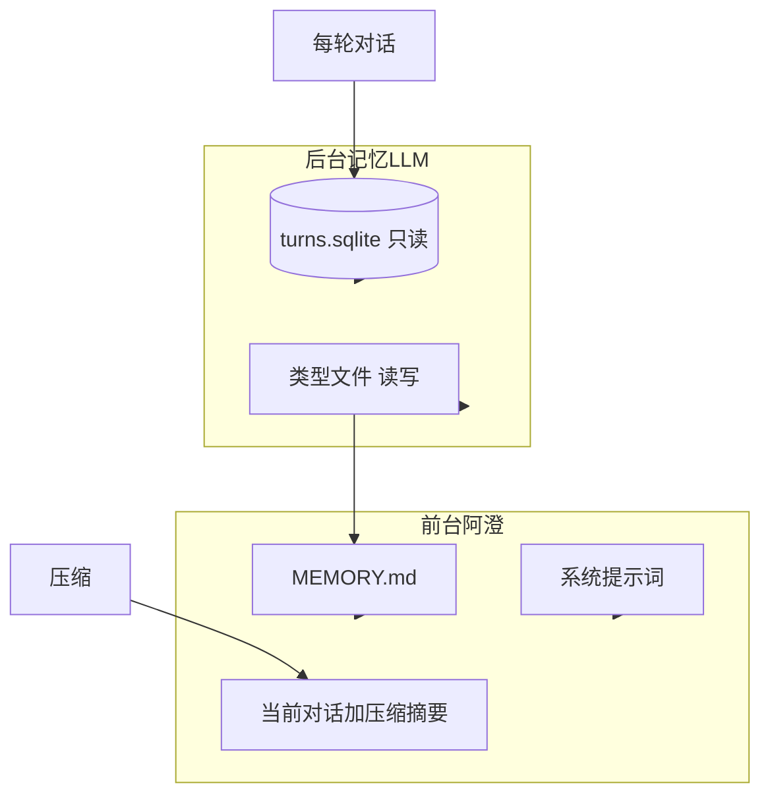

# 记忆系统

日期：2026-09-16  
状态：布局已定。后台 harness 见 [memory-agent-harness-design.md](superpowers/specs/2026-09-15-memory-agent-harness-design.md)。对照 [context-compression.md](context-compression.md)。

## 两套后台，三样前台

后台记忆 LLM 和前台阿澄是两路。记忆过程不对用户暴露。没有会话列表，没有「新对话」。

**后台维护两套：**

1. **SQLite 原始对话（只读）** — `data/memory/turns.sqlite`。程序每轮 `append`。模型只有 `search_turns`，不能写库，看不见 `.sqlite` 文件。这是收据，不是记忆。时间轴只在这里，没有按日日记。
2. **类型化文件记忆（读写）** — 闭合四类档案：`user.md`（他）、`relationship.md`（你们）、`boundaries.md`（纠偏）、`threads.md`（约定和未完的线）。真正巩固时才重写给前台的 `MEMORY.md`。开口不跑模型。人离开且有新轮次才叫醒。细节见 [harness 设计](superpowers/specs/2026-09-15-memory-agent-harness-design.md)。

**前台只看三样：**

1. **当前对话 + 可能出现的压缩摘要** — `Session.messages`（断线不清，不从库回灌）+ `rolling.md` 经 `SummaryReady` 变成「近期脉络」。压缩不是记忆，见 [context-compression.md](context-compression.md)。后台文件工具看不见 `rolling.md`。
2. **系统提示词** — `soumate/prompts/01-soul.md` / `02-medium.md` / `03-tools.md`。人设只这一份，聊天不改。后台不维护第二份 Soul。
3. **后台提炼后的 `MEMORY.md`** — 硬帽约 200 行 / 25KB。短句工作集，不是档案全文，也不是链接列表。阿澄不读库、不读四类档案。两次巩固之间用磁盘上这份小抄，开口不等后台。

后台若改档案时需要知道「她叫什么」：只读注入同一份 Soul 到记忆 agent 的 system，这是约束，不是第三套存储。

## 和压缩的边界

记忆：跨打开还认识他。压缩：1M 窗口满了还能接着聊。压缩只改窗口和 `rolling.md`，不写 `MEMORY.md` / 类型档案 / SQLite。被裁原文仍在库里。

小名进 `relationship.md` / `MEMORY.md`，不写进 Soul。压缩摘要在记忆还没接住前必须仍能带着互称。

## 值得记下什么

忘掉会伤到他，或她会像没共同经历过 —— 才写。过场丢掉。拿不准不写。空操作是正确结果。

写：纠偏与边界（尽量留原话）、稳定偏好与身分、闲聊里的自我揭露、约定和未完的线、已经稳定的互称或梗。

不写：寒暄、过场吃什么、没有新信息的陪聊、她自己的长独白、系统轮、一次性琐事、已被纠正的旧说法、情感量表、今日议题。

按类型落文件：他 → `user.md`；你们 / 互称 / 梗 → `relationship.md`；纠偏 → `boundaries.md`；约定和未完 → `threads.md`。情感不在记忆系统里做。

## 后台 1 已落地

- `TurnClosed` → `TurnStore.append`。库空时一次性导入旧 `transcripts/*.jsonl`。
- `search_turns`：`pattern` / `since` / `until` / `day` / `field` / `n`（默认 20，硬帽 500）/ `order`。`LIKE` 子串，`%` `_` 当字面量。超过 n 则 `truncated`。阿澄不挂这个工具。
- 无 API key 时不跑记忆 LLM。

## 后台 2：文件记忆

按 [harness 设计](superpowers/specs/2026-09-15-memory-agent-harness-design.md) 实现：一种巩固循环、四类档案、开口不跑模型。不要往上叠热度、遗忘、向量。

对照清单：[todo.md](todo.md)。第 1 项循环已落地；抽取质量见清单第 1 项「还剩」。

## 明确不是谁的

- `persona.md`：已废弃，禁止再写出来。
- `rolling.md`：只给前台。
- `self_state.md`：情感，记忆 agent 不读不写。
- 按日 `logs/`：时间轴在 sqlite，不再当记忆文件。
- Soul 磁盘、sqlite 文件：后台不当普通文件来读写。
