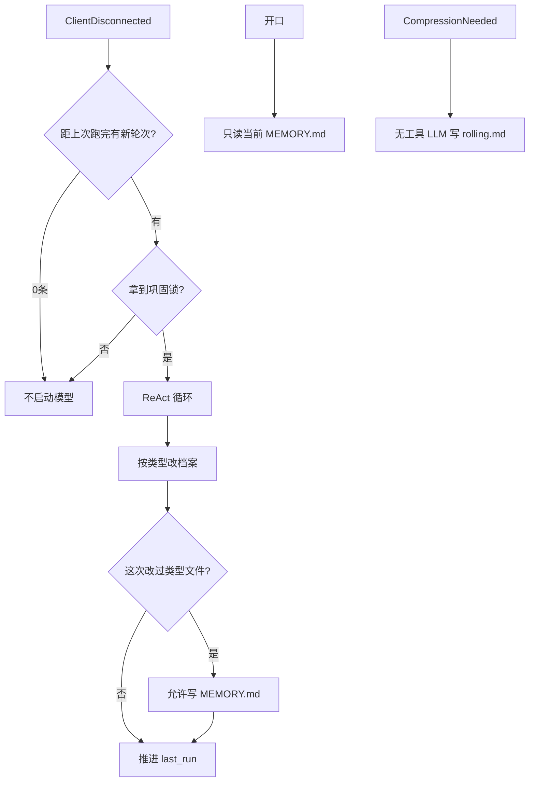

# 后台记忆 agent harness

日期：2026-09-15  
状态：设计已定，循环已落地。对照 [memory-system.md](../../memory-system.md)、[context-compression.md](../../context-compression.md)。

后台记忆 LLM 是挂在总线上的独立一路，不是阿澄。它维护类型化的文件记忆，并在真正巩固时重写阿澄能看见的 `MEMORY.md`。不嵌 Pi，不引入第三种语言；循环是 Python `MemoryAgent` 里的 ReAct。

## 1. 目标与边界

长期陪伴的一致性由后台做。对话当时阿澄靠 1M 窗口、已有小抄、滚动摘要；记忆抽取全异步，失败或迟到都不挡开口。

后台维护两套：

1. `turns.sqlite`：对话收据。程序每轮 `append`。模型只有 `search_turns`，不能写库。
2. 类型化文件：`user.md` / `relationship.md` / `boundaries.md` / `threads.md`，外加投影给阿澄的 `MEMORY.md`。

前台只看三样：当前对话（加可能出现的压缩摘要）、Soul 等系统提示词、`MEMORY.md`。阿澄没有文件工具，也没有 `search_turns`。因此 `MEMORY.md` 是短句工作集，不是文件目录索引。

压缩不是记忆：1M 窗口满了时一次无工具 LLM 写 `rolling.md`，见压缩文档。压缩不进本 harness 的工具循环。

情感不做：`self_state.md` 记忆 agent 不读不写。心情另开设计。

## 2. 何时跑

开口不跑记忆 LLM。`RecallRequested` 不再启动巩固循环；需要工作集时用磁盘上当前的 `MEMORY.md`。

人离开（`ClientDisconnected`）是唯一叫醒窗口。

程序只拦机械事实：距上次**跑完**以来，库里新轮次为 0，则不启动模型。寒暄、有没有值得写的，由模型读库判断。不用 24 小时、不用「连过 5 次」硬门。

无 API key：不启动、不推进「上次跑完」游标。

同时只一场巩固：文件锁拿不到就跳过。梦还在做、人又进来：阿澄继续用旧小抄。

## 3. 文件：按类型，不按日

时间轴只在 sqlite。不要按日日记 `logs/YYYY-MM-DD.md`。模型不得新建闭合清单以外的路径。

| 文件 | 类型 | 写什么 |
|---|---|---|
| `user.md` | 他 | 身分、稳定偏好、闲聊里的自我揭露 |
| `relationship.md` | 你们 | 互称、相处方式、已经稳定的梗。小名在这里，不在 Soul |
| `boundaries.md` | 纠偏 | 别那样叫我、哪句过分了、不要再提。尽量留原话 |
| `threads.md` | 未完 | 约定、他说以后再说。已经关掉的在巩固时删掉 |
| `MEMORY.md` | 小抄 | 阿澄下次开口、窗口里可能已经没有的短句。硬帽 200 行 / 25KB |

不可见、不可写：`.sqlite`、`rolling.md`、Soul、`persona.md`、`self_state.md`、点文件。磁盘上若仍有 `self_state.md` 或 `logs/`，本 agent 当不存在。

同一次巩固由浅到深，允许在某一层停：

1. 用 `search_turns(since=last_run, order=asc)` 读新原文；若 `truncated`，把 `since` 推到返回的最后一条时间再搜。
2. 稳定下来的事实按类型写入上面四份档案。去重；新说法覆盖旧说法；相对日期改成绝对日期。拿不准的不升档。
3. 仅当这次已经改过至少一份类型文件，才允许整份重写 `MEMORY.md`。把档案里她没有窗口也用得着的短句写进去，不要贴档案全文，不要写成链接列表。

写什么：忘掉会伤到他、或她会像没共同经历过 —— 才写。过场丢掉。拿不准不写。空操作是正确结果。

不写：寒暄、过场吃什么、没有新信息的陪聊、她自己的长独白、系统轮、一次性琐事、已被纠正的旧说法、情感量表、今日议题。

两次巩固之间，新事实靠 1M 窗口和 `rolling.md` 撑着。压缩摘要在记忆还没接住前必须仍能带着互称。

## 4. 游标：看过 vs 做过梦

`last_run` 是上次巩固循环**正常结束**的时间（含空操作），落在记忆目录的 `.last_run`（ISO 时间，模型看不见）。程序用它做两件事：判断有没有新轮次；注入任务里的 `since`。

- 从未跑过：只要库非空就启动；任务里不设 `since`（或从最早一条起扫）。
- 空操作也推进 `last_run`。否则每次离开都会把同一段寒暄再喂一遍。
- LLM 或循环异常退出：不推进 `last_run`，下次带着同一段 `since` 重跑。不做跨文件事务；中途已写入的文件保持原样，下一次靠「读过再写、去重、新覆盖旧」收。
- 无 key 不推进。

`last_run` 与巩固锁是程序状态，不是记忆文件，模型看不见。

## 5. Runtime

[`MemoryAgent`](../../../memory_agent/agent.py) 同时做两件事：总线适配，以及巩固时的工具循环。

总线：`TurnClosed` 只 `append` sqlite；离开时按第 2 节调度；连接时发当前 `MEMORY.md`，磁盘上有 `rolling.md` 则回灌 `SummaryReady`。小抄若在人已经回来之后才被改掉，再发一次 `ContextReady`。

工具循环：

- 一种 job：巩固（consolidate）。删除开口 recall、断开 extract 两条 LLM 路径。
- 一把 asyncio 锁，加上第 2 节的文件锁。
- 非流式 `complete_with_tools`，直到模型不再调工具，或达到步数上限（约 20）。巩固开 thinking。
- 工具失败把错误字符串当 tool 结果返回，循环继续。
- 记忆 LLM 自己的上下文只做轻截断（`search_turns` 已有 `n` 硬帽 500）。不做阿澄那套五段摘要。
- 用现有 DeepSeek / OpenAI 兼容 SDK。不嵌 Pi，不提供 bash / MCP / 子 agent / 会话树。

任务由程序注入，不另做统计工具：`last_run`（或从未跑过）、新增轮次数、今天日期。模型自己检索。

## 6. 工具与硬规则

两套工具，同一循环里按名字出现：

- 检索：`search_turns`（只读 sqlite）。
- 文件：`ls` / `read` / `grep` / `write` / `write_section`。
- 不提供 `append`。

程序硬规则，不靠模型自觉：

- 写闭合五份以外的路径失败。
- 本次循环还没成功写过 `user.md` / `relationship.md` / `boundaries.md` / `threads.md` 之一，就 `write` / `write_section` `MEMORY.md` 失败。
- `MEMORY.md` 超 200 行或 25KB 失败，必须先删再写。
- `ls` / `read` / `grep` 跳过不可见文件（第 3 节）。
- 不能写 sqlite。

提示词：只读 Soul + `agent.md` + `consolidate.md`（类型路由、空操作正确、未巩固不写小抄）。extract / recall / dream 提示词已停用。

## 7. 和压缩的边界

| | 记忆巩固 | 窗口压缩 |
|---|---|---|
| 触发 | 离开且有新轮次 | 整包 prompt 超过窗口 85% |
| 模型 | 有工具的 ReAct | 一次无工具 LLM |
| 写入 | 四类档案，可能重写 `MEMORY.md` | 只写 `rolling.md` |
| 目的 | 下次还认识他 | 这段还能接着聊 |

压缩仍挂在 `MemoryAgent` 上，但不进 ReAct。记忆工具看不见 `rolling.md`。巩固不写 `rolling.md`。

## 8. 错误

- 单次工具错误：回传给模型，继续。
- 整次循环抛错或 LLM 失败：打日志，释放锁，不推进 `last_run`。
- 无跨文件回滚。

## 9. 测试必须锁住

- 距 `last_run` 零条新轮次：不调模型。
- 开口 / `RecallRequested`：不跑巩固循环。
- 闭合路径：不能写五份以外的文件；看不见 sqlite / rolling / Soul / self_state。
- 没改类型文件就写 `MEMORY.md`：拒绝。
- 空操作也推进 `last_run`；异常退出不推进。
- 压缩仍只动 `rolling.md`。
- 巩固锁被占用时第二次离开不启动第二场。

## 10. 明确不做

- Pi、第三种语言、通用 coding agent。
- 开口侧查询、热度、遗忘曲线、向量库。
- 记忆 agent 维护情感内部状态或 `self_state.md`。
- 按日日记、会话列表、给阿澄文件工具或 `search_turns`。
- 聊天改 Soul。

实现不在本文。循环已落地；抽取质量见 [todo.md](../../todo.md) 第 1 项。
