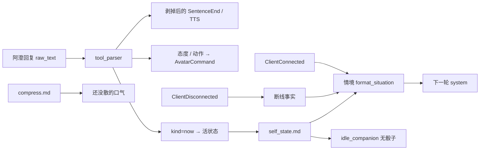

# 情感系统（短期）

日期：2026-09-17  
状态：设计已定，代码已落地。对照 [todo.md](../../todo.md) 第 7 节、[memory-agent-harness-design.md](2026-09-15-memory-agent-harness-design.md)、[motion-control-design.md](2026-09-16-motion-control-design.md)、[开源陪伴调研](../../2026-09-14-open-source-companion-research.md) 第 6 节。

情感是阿澄对刚发生的事当场写下的短感受。用户看不见。没有旁观模型，没有数值轴，没有按时间衰减。长期「对他怎样」「她自己是谁」仍是记忆，本文件不碰。

## 1. 范围

只做两层：

1. **当下反应**：已有句末 `⟦happy⟧` 一类态度标记，随句驱脸。本版不改十词表。
2. **当天心情**：新标记 `⟦此刻 …⟧`。她自己写，只在心情相对上一轮有变化时写。不写就是没变。

五条约束：

- 事件驱动：只在事发生时变。无 tick、无半衰期、无 PAD。
- 她自己产生：文字由阿澄（带 Soul）在回复里写下。不设旁观 LLM，不做人走后反思循环。
- 对用户不可见：TTS、前端气泡、任何可见 UI 都剥掉标记。`self_state.md` 不展示。
- 当天有效：跨自然日不再注入 prompt。跨周跨月的感受不在这里沉淀。
- 质量依赖模型：现在就要把「此刻」和上下文一起留作后训练语料。后训练实施是独立项目。

明确不做：

- PAD / valence / arousal、连续值衰减、基线漂移。
- 每轮旁观小模型打分、CPM 多 agent 流水线、人走后用另一个 prompt 替她重写心情。
- `self_state.md` 里的长期段落（「对他」「我」）。
- 把心情数字塞进对话 prompt。
- 改记忆 agent 的工具集或让它读写 `self_state.md`。
- 无事随便搭话的低概率骰子（第一版去掉 idle 骰子；`session_open` 与到期回访保留）。
- 扩充 `⟦emotion⟧` 十词表（实聊后再看脸和词是否对得上）。

## 2. 理论依据

评价理论（Lazarus；Scherer 的 CPM；OCC）的共同立场：情绪是对事件的评价，不是自己漂的随机量。EMA（Gratch & Marsella）再加一条：情绪总是关于某件事，状态改变靠重新评价（他又说了什么、他走了又回来），不是靠计时器。Chain-of-Emotion（Croissant et al., 2024）说明第一人称感受文字进上下文，比「只靠记忆」更像有心情。

本设计只抄这个立场：事件 → 她自己写下感受 → 把原文放回她眼前。不抄 OCC 的 22 类公式、不抄 PAD 冲量、不抄多路评价 agent。调研条目见开源陪伴文档第 6 节。

## 3. 两条标记，各管一层

| 标记 | 谁用 | 寿命 | 进身体？ |
|---|---|---|---|
| `⟦happy⟧` 等十个态度 | 这一句的脸 | 跟句走 | 是，走现有 `AvatarCommand` |
| `⟦wave⟧` / `⟦stop⟧` | 这一句的身体 | 跟句走 | 是 |
| `⟦此刻 有点委屈，他刚才那句话⟧` | 当天还没散的心情 | 被下一句此刻覆盖，或跨日清空 | 否 |

态度仍按动作控制文档：每句尽量句末一个。此刻不是脸，不要用它替代 `⟦sad⟧`。同一句可以同时有态度和此刻。

## 4. 「此刻」标记

### 4.1 形态

```
⟦此刻 有点委屈，他刚才那句话⟧
```

规则：

- 关键字是汉字「此刻」，后面至少一个空白，再跟正文。
- 正文：一句人话。写感受，并点出是哪件事。不要量表词，不要数字轴，不要对用户说话。
- 只在心情相对上一轮有变化时写。连续几轮同一心情，不要每句都写。
- 一轮里出现多次：最后一次生效。
- 关键字对但正文剥空：当作没写，保留上一份此刻。

上限：正文最多 40 个字符（Unicode 码位，空白算进去）。超出截到 40，不报错。句末终止符（。！？）后的内容丢掉，只留第一句。

量表词黑名单（正文含则整枚标记丢弃，保留上一份此刻）：`valence`、`arousal`、`PAD`、`intensity`、`好感度`、`心情值`、`效价`、`唤醒`；以及带小数点的纯数字（如 `0.6`）、`数字/数字`（如 `3/10`）、阿拉伯数字后紧跟「分」（如 `4分`）。「过分」这类不含数字的词不算。

### 4.2 解析

现有 [`soumate/asm/brain/tool_parser.py`](../../../soumate/asm/brain/tool_parser.py) 的 `TAG_RE` 只认 `[a-z_]+`，`⟦此刻 …⟧` 会漏到 TTS。必须先扩正则。

- 先匹配 `⟦此刻\s+([^⟦⟧]+)⟧`，再匹配原有三类。
- `Marker.kind = "now"`，`name` 为截断后的正文。
- `collect_tags` / `AvatarCommand` 忽略 `kind == "now"`。不要记进 `unresolved_markers.jsonl`。
- `EmotionStripper` 同一条流式路径剥离。`INCOMPLETE_TAIL` 改成能咬住未闭合的 `⟦…`（含汉字），例如未闭合前缀用 `⟦[^⟧]*$`。回合结束 `flush` 仍未闭合：丢掉半截，禁止把 `⟦` 漏给 TTS。
- 旧的 `[emo=happy]` / `⟦happy⟧` 行为不变。混排必须同时测。

剥掉后的可见文本、以及发给 TTS 的 `SentenceEnd.text`，都不得含 `⟦` `⟧` 或「此刻」标记。聊天历史和 `turns.sqlite` 仍存带标记的 `raw_text`（与现有态度标记相同，见 commit `5e4dd69`）。

剥离随句做，活状态不随句写：只有本轮 `TurnDone` 且不是打断，才用该轮最后一次有效此刻覆盖磁盘。打断或半截回合保持上一份此刻。本轮写下的此刻从**下一轮**才进入 `情境`。

### 4.3 存储

会话内存一份，磁盘一份。磁盘路径：`data/memory/self_state.md`。该目录已在 `.gitignore`（`data/memory/*`），继续保持本地、不进 git。记忆 agent 已不读不写此文件，保持。

文件只这一段，程序写、程序读，不用 LLM 维护：

```
此刻：有点委屈，他刚才那句话
写下：2026-09-17T19:41:00
来源：turn_abc123
```

- `写下`：本地 ISO 时间，精确到秒。
- `来源`：写出这一句的 `turn_id`，与 `turns.sqlite` 同一字段。后训练用它回查上下文。
- 没有此刻：文件不存在或正文为空，都当没有。
- 被覆盖：整份重写，不追加历史。历史以 sqlite 里带 `⟦此刻⟧` 的 assistant 原文为准。

### 4.4 进 prompt

拼进已有的 `情境` 块（[`format_situation`](../../../soumate/asm/brain/prompt.py)），与「现在几点、距上次多久」同一条易变 system。不动 Soul / medium / tools / `长期记忆`。

有此刻且仍在当天：

```
现在是 2026-09-17 星期四 19:55。距上次聊天大约 0 小时。
你此刻：有点委屈，他刚才那句话（14 分钟前）。
```

「N 分钟前」用 `写下` 与当前时间的差，不足 1 分钟写「刚刚」。模型只看人话，不看文件、不看 turn_id。

### 4.5 结束（事件，不是衰减）

活状态（会进 prompt、会挡开口）按下面三条清。sqlite 里的原文不动。

1. **被下一句此刻覆盖。** 新正文写入内存和磁盘。
2. **他离开又在当天回来。** `ClientConnected` 时若此刻仍在、且 `写下` 的本地日期仍是今天：情境改写成「上次分开时你：…。过去了 N 小时。」这是改情境措辞，不调模型。她完整回完一轮（`TurnDone`，且不是打断）之后清空，除非这一轮又写了新的此刻（则新的生效，不清）。
3. **跨过 `写下` 那天的本地 24:00。** 立刻停止注入并清空活状态。长会话跨午夜也清。磁盘文件清空。

他离开本身不写新心情、不跑模型。

## 5. 非对话事件当事实递给她

系统不预算「她该生气」。只把事实塞进 `情境` 或已有的 `ProactiveTrigger.hint`，由她自己用态度 / 此刻反应。

第一版三种：

| 事件 | 怎么发现 | 递给她的事实 |
|---|---|---|
| 她说到一半他断线 | `ClientDisconnected` 时本轮已在生成或仍在播 | 下次见面的情境加一句「上次你说到一半，他断线了。」 |
| 离开后回来 | 已有 `session_open` | 已有「距上次 N 小时」；若当天还有此刻，按 4.5 条 2 改写 |
| 答应的事到期 | 已有 `due_callbacks` 扫 `relationship.md` 的 `截止日期:` | 不改；仍发 `ProactiveTrigger(reason="callback")` |

断线标记是会话级小状态，不要写进 `self_state.md`（那份文件只承载此刻）。进过一次情境并被她回过一轮后清掉，避免每次见面都提。

## 6. 主动开口

不改 [`ProactiveTrigger(reason, hint)`](../../../soumate/asm/core/events.py)。每日上限、冷却、idle 秒数仍由 [`ImpulseScheduler`](../../../soumate/asm/impulse/scheduler.py) 管。

改 [`idle_companion`](../../../soumate/asm/impulse/triggers.py)：

- 现有门仍在：麦开着、idle 超过阈值。
- **去掉 0.3 骰子。**
- 此刻非空（活状态，未跨日）→ 发 `reason="idle_companion"`，`hint` 就是此刻正文。
- 此刻为空 → 返回 `None`。不靠随机找他聊天。
- `session_open`、到期回访原样，不受此刻有无影响。

`self_state_text()` 仍可给调度器读文件，但 hint 必须解析 `此刻：` 字段，不要把 `写下：` 那一行塞给她。

无事闲聊的低概率开口：第一版不做。以后若加，另开设计，不要和此刻门控叠回骰子。

## 7. 压缩保口气

[`memory_agent/prompts/compress.md`](../../../memory_agent/prompts/compress.md) 第 3 项已有「还没散的口气」。补两句硬约束：

- 被裁原文里若有 `⟦此刻 …⟧`，正文进「还没散的口气」，连同原因。不要把标记本身抄进摘要。
- 不要把口气编成「今日议题」或任务。已消退的仍写「无」。

压缩 LLM 仍是无工具一次调用。不要为情感新开压缩通道。

## 8. 提示词

[`soumate/prompts/03-tools.md`](../../../soumate/prompts/03-tools.md) 增加此刻说明，放在态度 / 动作规则之后。大意（实现时可收短，不得改变意思）：

- `⟦此刻 …⟧` 是给你自己看的当天心情，用户看不见、也听不见。
- 只在心情相对上一轮有变化时写一句。没有变化就不要写。
- 正文是人话：感受 + 是哪件事。不要数字，不要量表，不要对他说「我现在的心情是」。
- 不是脸。脸仍用句末态度标记。

`01-soul.md`、`02-medium.md` 不写此刻语法。Soul 继续管她是谁，不管标记格式。

## 9. 后训练与数据留痕

这一层的好坏等于模型会不会在该写的时候写、不该写的时候闭嘴。上线前就要留数据，但 **SFT / DPO、基座选择不在本设计里做**。

已有：带标记的 assistant 原文进聊天历史，并经 `TurnClosed` 落入 `turns.sqlite` 的 `assistant_text`。

本设计补的：

- 活状态里的 `来源` = 写出此刻的 `turn_id`。
- 标注口径（人工，离线）。针对一轮，看用户原文 + 前几轮 + 她是否写了此刻：

| 标签 | 含义 |
|---|---|
| `correct` | 该写且写了，正文点到了那件事 |
| `missed` | 该写没写 |
| `spurious` | 不该写却写了（寒暄、重复同一心情、把态度写进此刻） |
| `malformed` | 写了但量表词 / 超长 / 空正文 / 对用户说话 |

评测集两路：

1. 实聊抽样：从 sqlite 抽含此刻和不含此刻的轮次，按上表标。
2. 事件线脚本（假时钟，测 harness 不测文采）：给定带此刻的 `raw_text` → 下一轮情境含正文；无标记 → 活状态不变；同日重连 → 情境含「上次分开时你」且回一轮后清空；跨日 → 不再注入；说到一半断线 → 下次情境有断线事实；有此刻才 `idle_companion`。模型「该不该写」只走上面的实聊标注，不写进 harness 脚本。

不要为标注新建第二套对话库。回查一律用 `turn_id` 进 sqlite。

## 10. 数据流



实时路径不增加模型调用。解析是正则。开口门控是读文件。

## 11. 护栏与测试点

护栏：

- 用户可见通道永不见标记。
- 记忆 agent 继续把 `self_state.md` 当不存在。
- 此刻不进 `AvatarCommand`。
- 活状态跨日必清；磁盘与内存一致。
- 提示词与测试禁止出现量表词进 prompt 的路径。

实现时至少覆盖：

- 解析：完整此刻；半截流式；与 `⟦happy⟧⟦wave⟧` 混排；空正文；超 40 字；量表词丢弃；一轮两次取最后一次；`flush` 未闭合。
- `情境`：有此刻、无此刻、N 分钟前、同日重连改写、跨日不注入。
- impulse：有此刻且麦开 idle 够久 → 触发，hint 为正文；无此刻 → `None`；`session_open` / callback 不受影响；冷却和每日上限仍生效。
- 剥离：`SentenceEnd` 与前端气泡不含 `⟦`。
- 压缩：人工核对项——含此刻的被裁前缀，摘要「还没散的口气」里有人话原因，没有标记本身，也没有被写成议题。

## 12. 实现落点（本文件批准后再改代码）

| 改什么 | 做什么 |
|---|---|
| `soumate/asm/brain/tool_parser.py` | 第四类标记、流式半截、`collect_tags` 忽略 now |
| `soumate/asm/brain/runtime.py` | 剥离 now，不发 set_emotion；不在半句时写盘 |
| `soumate/asm/core/orchestrator.py` | `TurnDone` 非打断才提交活状态；重连 / 断线事实 / 跨日清空 |
| `soumate/asm/brain/prompt.py` | `format_situation` 拼此刻 / 重连改写 / 断线事实 |
| `soumate/asm/impulse/triggers.py` | 去掉骰子；按此刻正文门控 |
| `soumate/prompts/03-tools.md` | 此刻用法 |
| `memory_agent/prompts/compress.md` | 口气硬约束 |
| `data/memory/self_state.md` | 程序读写短文件 |
| `test/brain/test_tool_parser.py` 等 | 上一节测试点 |

不改 `_on_proactive`：仍只吃 `ProactiveTrigger(reason, hint)`。不改记忆 agent 工具白名单。
